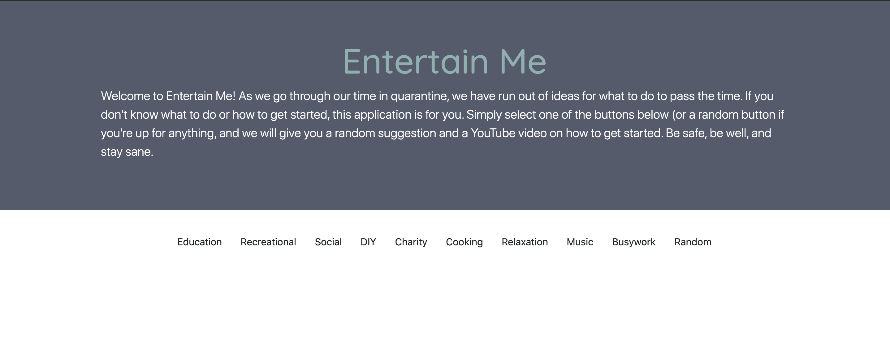

# Entertain Me
Welcome to Entertain Me! As we go through our time in quarantine, we have run out of ideas for what to do to pass the time. If you don't know what to do or how to get started, this application is for you. Simply select one of the buttons below (or a random button if you're up for anything, and we will give you a random suggestion and a YouTube video on how to get started. Be safe, be well, and stay sane.

## Table of Contents 

* [Installation](#installation)
* [Usage](#usage)
* [MIT License](#MIT-License)
* [Contributing](#Contributing)

## Installation

Clone repository on local machine and run HTML file in browser. After opening the app in the browser, you be presented with a series of buttons, each of which has a type of activity for you to try. 

## Usage 
The present application was made to help users find something to do when they are bored and to be exposed to activities they would not be exposed to otherwise.

[Deployed Entertain Me Site](https://mayastucky.github.io/gt-project-1/)

## MIT License

Copyright (c) [2020] [Nick, Maya, Brian, Diego]

Permission is hereby granted, free of charge, to any person obtaining a copy
of this software and associated documentation files (the "Software"), to deal
in the Software without restriction, including without limitation the rights
to use, copy, modify, merge, publish, distribute, sublicense, and/or sell
copies of the Software, and to permit persons to whom the Software is
furnished to do so, subject to the following conditions:

The above copyright notice and this permission notice shall be included in all
copies or substantial portions of the Software.

THE SOFTWARE IS PROVIDED "AS IS", WITHOUT WARRANTY OF ANY KIND, EXPRESS OR
IMPLIED, INCLUDING BUT NOT LIMITED TO THE WARRANTIES OF MERCHANTABILITY,
FITNESS FOR A PARTICULAR PURPOSE AND NONINFRINGEMENT. IN NO EVENT SHALL THE
AUTHORS OR COPYRIGHT HOLDERS BE LIABLE FOR ANY CLAIM, DAMAGES OR OTHER
LIABILITY, WHETHER IN AN ACTION OF CONTRACT, TORT OR OTHERWISE, ARISING FROM,
OUT OF OR IN CONNECTION WITH THE SOFTWARE OR THE USE OR OTHER DEALINGS IN THE
SOFTWARE.
---

## Contributing

Nick, Maya, Brian and Diego combinated efforts to create Entertain Me. 